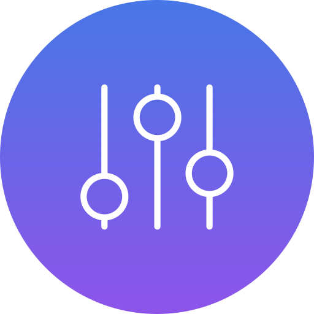

## Deej Firmware

<br/>

Firmware repo for Deej, a StreamDeck like DIY mixer. 

### Companion App

The companion app allows you to connect the Deej device to your computer. 

[GitHub Repo (Deej-Companion)](https://github.com/UnoMartino/Deej-Companion) 

### Flashing

Flash the firmware file to your device at offset 0x0 using your favorite tool (or use this browser-based utility [Adafruit_WebSerial_ESPTool](https://adafruit.github.io/Adafruit_WebSerial_ESPTool/)).


### Adapting/building

If you want to make changes or build your own firmware you can use PlatformIO. 

After compiling the firmware in PIO you can use the provided merger script. It will create a combined bin file in the `.pio` folder.

From the root of the project run:
```
.\merge_bin.bat
```

### Device information

The device is based on the ESP32 ESP-WROOM-32 DevKit V1 microcontroller (see [photo](img/ESP32-Pinout.jpg)). The firmware is written in C++ and uses the Arduino framework.

Pinout:
```
Button 1: GPIO 12
Button 2: GPIO 25
Button 3: GPIO 33
Button 4: GPIO 32
Button 5: GPIO 19
Button 6: GPIO 18
Button 7: GPIO 15
Button 8: GPIO 23
Button 9: GPIO 4
Button 10: GPIO 16

Potentiometer 1: GPIO 26
Potentiometer 2: GPIO 14
Potentiometer 3: GPIO 27
Potentiometer 4: GPIO 13

OLED I2C SDA: GPIO 21
OLED I2C SCL: GPIO 22
```

This pinout is precompiled in the firmware. If you want to change it you can do so in the `src/main.cpp` file.

### Notes

You are free to modify the project according to the license.
